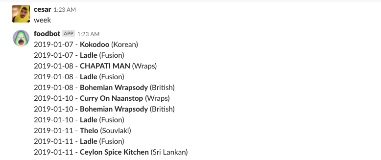
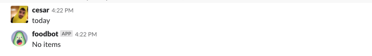
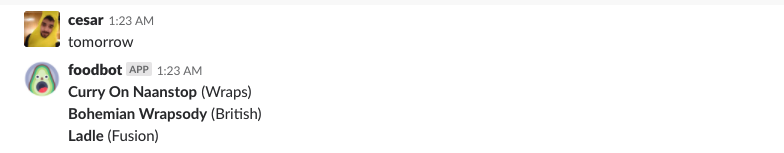

# [foodbot](https://github.com/cesarferreira/foodbot)
> A slack bot that knows what street food is available @ [Paddington Central](https://www.google.co.uk/search?q=paddington+central&source=lnms&tbm=isch&sa=X&ved=0ahUKEwit9eOoseHfAhU0rHEKHYq9DKEQ_AUIDygC&biw=1440&bih=712)

  

# Usage

  

# Food trucks for the week

  

# Today

  

# Tomorrow

  

--------

Made with ♥ by [cesar ferreira](https://github.com/cesarferreira)